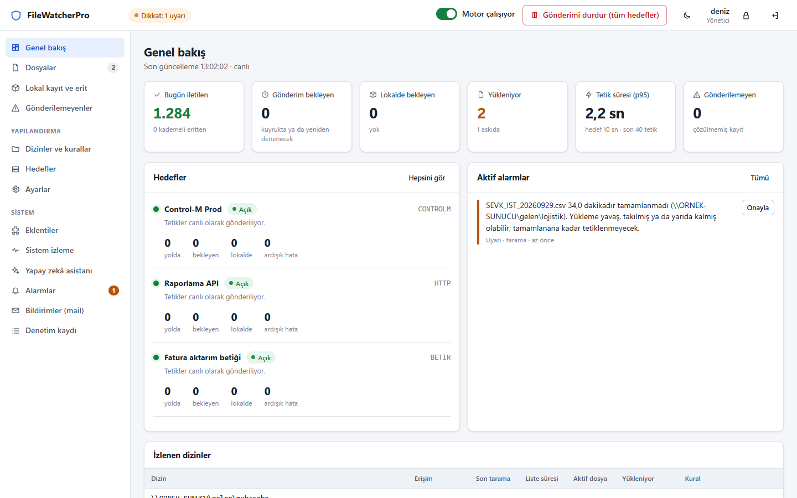
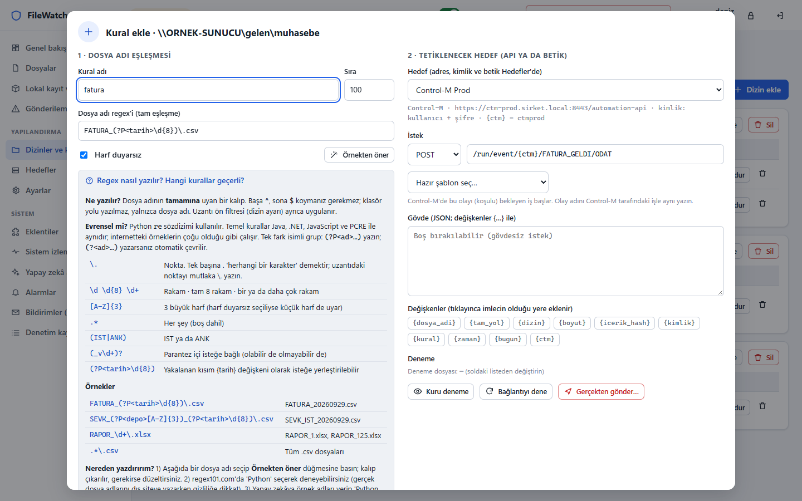
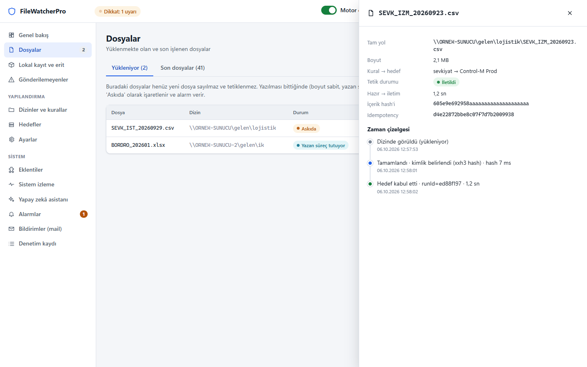
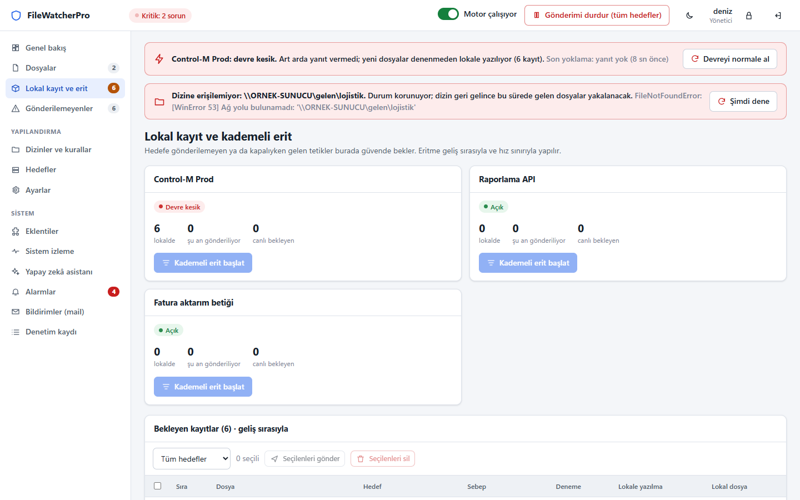
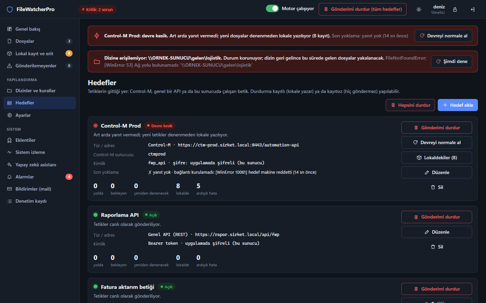
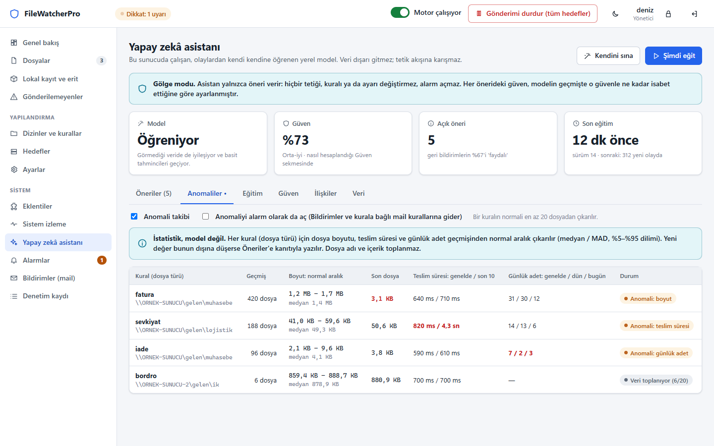
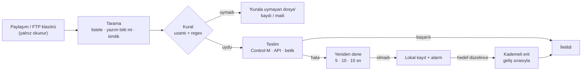
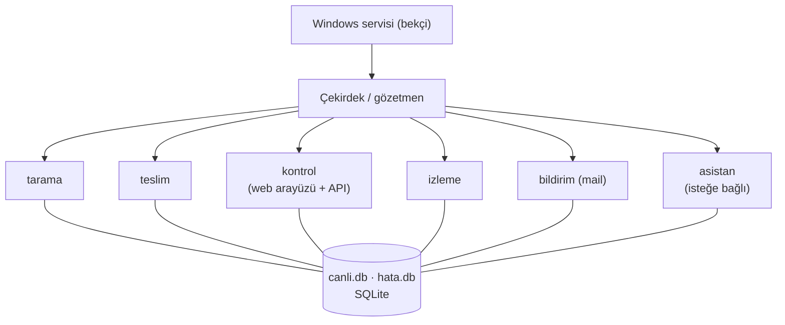

# FileWatcherPro

Bir FTP / SFTP sunucusunun ya da herhangi bir uygulamanın dosya bıraktığı klasörleri izler; kurala uyan her yeni
dosya için bir iş tetikler: **Control-M** işi, **REST API** çağrısı ya da sunucuda çalışan bir **Python / PowerShell
betiği**. Windows servisi olarak çalışır, tarayıcıdan yönetilir.

Tasarımdaki iki öncelik:

- **Hiçbir dosya kaçmaz.** Hedef sistem çökse bile tetikler diskte korunur; sistem düzelince geliş sırasıyla gönderilir.
- **Yanlış dosyaya tepki verilmez.** Yazılmakta olan, yarım yüklenen ya da kurala uymayan dosya tetiklenmez; aynı
  dosya iki kez tetiklenmez.

---

## Ne yapar

| | |
|---|---|
| **Dosya yakalama** | Dizinler düzenli aralıkla listelenir; her dosya adı ve Windows dosya kimliğiyle ayrı izlenir (sayı karşılaştırması yapılmaz). Yazılmakta olan, başka süreçte açık ya da `.filepart` gibi geçici adla yüklenen dosya beklenir; yazım bitince tek tetik üretilir. |
| **Kurallar** | Dizin + uzantı + dosya adı kalıbı (regex). Aynı dizinde A dosyası A işini, B dosyası B işini tetikler. Kalıp ekranda gerçek dosya adlarıyla canlı denenir; istek göndermeden önce kuru denenir. |
| **Hedefler** | Control-M Automation API (oturum ya da API anahtarı), genel REST API (Bearer, API anahtarı, Basic), Python / PowerShell betiği. |
| **Kayıpsız teslim** | Yeniden deneme planı → lokal kayıt + alarm → hedef düzelince *kademeli erit* (geliş sırası, hız sınırı). Art arda hatada devre kesilir. Her tetik benzersiz bir kimlik taşır; hedef tarafında çift ayırt edilebilir. |
| **Operasyon kontrolü** | Hedef, tek kural, bir dizinin kuralları ya da tüm kurallar için "kayıtlı durdur" (dosyalar lokalde birikir) ve onaylı "kayıtsız durdur". Lokalde bekleyenlerden seçilenleri gönderme / gerekçeli ve tutanaklı silme. |
| **Arayüz** | Tarayıcıdan, internetsiz. İzleyici / Operatör / Yönetici rolleri; her yapılandırma değişikliği kim, ne zaman, eski ve yeni değerle denetim kaydına yazılır. |
| **Alarm ve mail** | 31 olay türü; seçilen olaylar seçilen dizinler ya da kurallar için maillenir (anında ya da özet, tekrar sınırı, "düzelince bildir"). |
| **Kendi sağlığı** | Sunucu ve uygulama CPU / bellek / disk izlenir; bileşen düşerse yeniden başlatılır; haftalık otomatik bakım ve son sağlam kopya. |
| **Yapay zekâ asistanı** *(isteğe bağlı)* | Yerelde çalışır, dışarı veri göndermez. "Beklenen dosya gelmedi" önerileri ve **anomali takibi**: hep 1–2 MB gelen dosya 3 KB gelirse, günlük adet yarıya düşerse ya da teslim yavaşlarsa kanıtlı uyarı. Tetik yoluna karışmaz. |

## Ekran görüntüleri

*Görüntüler arayüzün örnek veriyle çalışan prototip kipinden alınmıştır.*

| Genel bakış | Kural penceresi: regex canlı deneme ve istek |
|---|---|
|  |  |
| **Dosyanın zaman çizelgesi** | **Hedef çöktüğünde lokal kayıt ve kademeli erit** |
|  |  |
| **Hedefler (koyu tema)** | **Asistan: anomali takibi** |
|  |  |

Arayüzü kurulum yapmadan örnek veriyle görmek için `prototip_goster.bat` çalıştırın (`http://127.0.0.1:8790/?prototip`).

## Nasıl çalışır



Her bileşen ayrı bir süreçtir; biri düşerse gözetmen onu yeniden başlatır, diğerleri etkilenmez:



## Hızlı başlangıç (deneme makinesinde)

Gereken: Windows (masaüstü ya da Server), **Python 3.11 (64 bit)**. Geliştirme ve testler Windows 11 üzerinde
yapıldı.

```bat
py -3.11 -m pip install -r requirements.txt
baslat.bat
```

1. Tarayıcıda `http://127.0.0.1:8770` açılır. İlk giriş `admin` / `admin`; sağ üstteki kilit simgesinden şifreyi
   hemen değiştirin.
2. Gerçek bir hedef olmadan denemek için ikinci bir pencerede `sahte_controlm_baslat.bat` çalıştırın (sahte
   Control-M; adresi ekranda yazar).
3. **Hedefler → Hedef ekle → Control-M**: sahte adresi girin, kimlik "yok".
4. **Dizinler ve kurallar → Dizin ekle**: bir deneme klasörü, uzantı `.csv`.
5. **Kural ekle**: regex `DENEME_\d+\.csv`, hedef olarak az önce eklediğinizi seçin, şablon "olay ekle".
6. Klasöre `DENEME_1.csv` bırakın; **Genel bakış** ve **Dosyalar** sayfasında tetiğin yolunu izleyin.

Sunucuya kalıcı kurulum, servis hesabı ve canlıya geçiş adımları: [docs/01_DEVREYE_ALMA.md](docs/01_DEVREYE_ALMA.md).

## Belgeler

| Belge | İçerik |
|---|---|
| [01 · Devreye alma](docs/01_DEVREYE_ALMA.md) | Planlama, servis hesabı ve izinler, paketleme, Windows servisi (NSSM), doğrulama, canlıya geçiş listesi, sürüm yükseltme, kaldırma |
| [02 · Yapılandırma](docs/02_YAPILANDIRMA.md) | Hedefler, dizinler, kurallar, bildirimler, ayarlar, kullanıcılar ve roller |
| [03 · Kural yazma rehberi](docs/03_KURALLAR.md) | Eşleşme mantığı, regex tarifleri, değişkenler, Control-M / API istek örnekleri |
| [04 · Betik hedefi](docs/04_BETIK_HEDEFI.md) | Python / PowerShell betikleri: veri sözleşmesi, çıkış kodları, örnekler |
| [05 · Günlük işletim](docs/05_GUNLUK_ISLETIM.md) | Ekranlar, durdurma ve erit, lokal kayıt, alarmlar, bakım, asistan ve anomali |
| [06 · Arıza davranışı](docs/06_ARIZA_DAVRANISI.md) | Hedef, ağ, süreç, disk arızalarında ne olur; güvenceler |
| [07 · Güvenlik](docs/07_GUVENLIK.md) | Şifre saklama, roller, arayüz koruması, betik yalıtımı |
| [08 · Sorun giderme](docs/08_SORUN_GIDERME.md) | Belirti → neden → çözüm, loglar, tanı araçları |
| [Yönetici veri sayfası](docs/YONETICI_VERI_SAYFASI.md) | Tek sayfada teknik özellikler, varsayılanlar, olay kataloğu, işletim ve bakım kontrol listeleri |

## Proje yapısı

```
calistir.py              giriş noktası (çekirdeği başlatır)
baslat.bat               konsolda çalıştırma (deneme / elle kullanım)
betik_sifresi.bat        süper yönetici şifresini belirleme
config/baslangic.json    veri / log klasörü, arayüz adresi ve portu, bileşen listesi
cekirdek/                gözetmen, veritabanları, kurallar, ayarlar, olay kataloğu, betik çalıştırıcı
eklentiler/              tarama, teslim (+ hedef adaptörleri), kontrol (web arayüzü), izleme, bildirim, asistan
servis/                  Windows servisi sarmalayıcısı (bekçi)
araclar/                 yönetim ve tanı araçları (kullanıcı, şifre, servis doğrulama, FTP gözlem, paketleme…)
testler/                 otomatik testler, sahte Control-M ve SMTP sunucuları
docs/                    belgeler
```

## Testler

```bat
py -3.11 -m pip install pytest playwright
py -3.11 -m pytest testler -q
```

Önyüz testleri tarayıcı olarak Microsoft Edge kullanır. Gerçek sistemi sahte Control-M / API / mail sunucularıyla
baştan sona çalıştıran saha provası (geçici klasörde, ~2 dk; canlı kuruluma dokunmaz):

```bat
py -3.11 araclar\saha_provasi.py
```

## Lisans

[MIT](LICENSE) © 2026 İlhan Koçaslan
