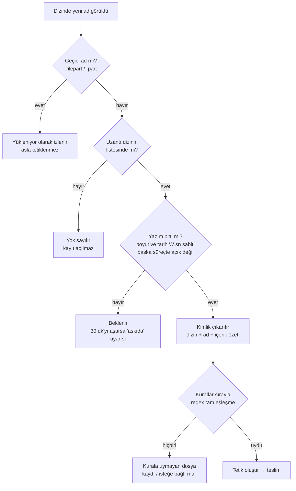

# 03 · Kural yazma rehberi

Kural, "bu dizine bu adla gelen dosya, şu hedefte şu isteği tetiklesin" demektir. Bu belge kuralın nasıl
eşleştiğini, regex'in nasıl yazılacağını ve isteğin nasıl kurulacağını örneklerle anlatır.

- [Bir dosya nasıl tetiğe dönüşür](#bir-dosya-nasıl-tetiğe-dönüşür)
- [Regex: hızlı başvuru](#regex-hızlı-başvuru)
- [Tarifler](#tarifler)
- [Değişkenler ve isimli gruplar](#değişkenler-ve-isimli-gruplar)
- [Hedefe giden istek](#hedefe-giden-istek)
- [Denemek: canlı deneme, kuru deneme, gerçek gönderim](#denemek)
- [Hedefin yanıtı nasıl yorumlanır](#hedefin-yanıtı-nasıl-yorumlanır)
- [Sık yapılan hatalar](#sık-yapılan-hatalar)

---

## Bir dosya nasıl tetiğe dönüşür



Bilinmesi gerekenler:

1. **Regex dosya adının tamamına uygulanır, uzantı dahil.** `FATURA_\d{8}` deseni `FATURA_20261001.csv` adını
   **tutmaz**; doğrusu `FATURA_\d{8}\.csv`. Başa `^`, sona `$` yazmak gerekmez.
2. **Regex'teki uzantı dizinin uzantı listesinde olmalıdır.** Liste `.csv` iken `\.txt` ile biten bir regex hiç
   tetiklenmez (o dosyalar taramada hiç görülmez).
3. **Sıra:** Kurallar küçük sıra numarasından büyüğe denenir. `coklu_kural = ilk` (varsayılan) ise ilk uyan kural
   tetiklenir; `hepsi` ise uyan her kural ayrı tetik üretir.
4. **Harf duyarsız** (varsayılan) açıkken `fatura_20261001.CSV` de uyar.
5. **Aynı dosya iki kez tetiklenmez.** Dizinde duran bir dosyanın içeriği sonradan değişirse yeni tetik oluşmaz (güncel
   hâli esas alınır). Dosya dizinden kalkıp yeniden gelirse bu yeni bir geliştir ve tetiklenir.
6. **Geçici adla yükleme:** `rapor.csv.filepart` görülürken `rapor.csv` "yükleniyor" olarak izlenir; yeniden
   adlandırma bitince `rapor.csv` normal akışla tetiklenir.

---

## Regex: hızlı başvuru

| Yazım | Anlamı | Örnek | Uyan |
|---|---|---|---|
| `\d` | bir rakam | `\d\d` | `07` |
| `\d{8}` | tam 8 rakam | `\d{8}` | `20261001` |
| `\d+` | bir ya da daha çok rakam | `NO_\d+` | `NO_7`, `NO_123` |
| `[A-Z]` | bir büyük harf | `[A-Z]{3}` | `IST` |
| `[A-Z0-9]` | harf ya da rakam | `[A-Z0-9]{6}` | `AB12CD` |
| `\w` | harf, rakam ya da `_` | `\w+` | `depo_1` |
| `.` | herhangi bir karakter | `A.B` | `A-B`, `A_B` |
| `.*` | herhangi bir şey (boş dahil) | `IADE_.*` | `IADE_`, `IADE_x y` |
| `\.` | gerçek nokta | `\.csv` | `.csv` |
| `(a\|b)` | a ya da b | `\.(csv\|txt)` | `.csv`, `.txt` |
| `?` | önceki öğe isteğe bağlı | `_v?\d` | `_1`, `_v1` |
| `\s` | boşluk | `Rapor\s\d+` | `Rapor 5` |
| `(?!…)` | ardından şu gelmesin | `(?!TEST_).*` | `TEST_` ile başlamayan her ad |
| `(?P<ad>…)` | isimli grup → değişken | `(?P<tarih>\d{8})` | `{tarih}` = `20261001` |

`(?<ad>…)` yazımı da kabul edilir (otomatik `(?P<ad>…)`'ya çevrilir). Desen en fazla 1000 karakterdir. Aşırı yavaş
desenler (ör. `(a+)+`) kaydedilirken reddedilir; canlı deneme de ayrı bir süreçte, süre sınırıyla çalışır.

---

## Tarifler

| İhtiyaç | Regex | Uyan | Uymayan |
|---|---|---|---|
| Tarihli dosya | `FATURA_(?P<tarih>\d{8})\.csv` | `FATURA_20261001.csv` | `FATURA_2026.csv` |
| Tarih + sıra no | `FATURA_(?P<tarih>\d{8})_(?P<no>\d+)\.csv` | `FATURA_20261001_015.csv` | `FATURA_20261001.csv` |
| Kodlu kaynak | `SEVK_(?P<depo>[A-Z]{3})_\w+\.csv` | `SEVK_IST_A17.csv` | `SEVK_IS_A17.csv` (2 harf) |
| Dönem (yıl-ay) | `BORDRO_(?P<donem>\d{6})\.xlsx` | `BORDRO_202610.xlsx` | `BORDRO_2026_10.xlsx` |
| Geçerli takvim tarihi | `EKSTRE_(?P<yil>20\d{2})(?P<ay>0[1-9]\|1[0-2])(?P<gun>0[1-9]\|[12]\d\|3[01])\.txt` | `EKSTRE_20261031.txt` | `EKSTRE_20261332.txt` |
| İki uzantı (ikisi de dizin listesinde) | `RAPOR_\d+\.(csv\|txt)` | `RAPOR_5.csv`, `RAPOR_5.txt` | `RAPOR_5.xlsx` |
| Önek sabit, gerisi serbest | `IADE_.*\.txt` | `IADE_x.txt`, `IADE_.txt` | `IADE.txt` (alt çizgi yok) |
| Belirli bir önekle başlayanları hariç tut | `(?!TEST_)[A-Z]+_\d{8}\.csv` | `SATIS_20261001.csv` | `TEST_20261001.csv` |
| Boşluklu ad | `Gunluk Rapor (?P<no>\d+)\.pdf` | `Gunluk Rapor 12.pdf` | `Gunluk_Rapor_12.pdf` |
| Tek, sabit dosya | `kapanis\.ok` | `kapanis.ok` | `kapanis.ok.bak` |

Harf duyarsız seçeneği açıkken (varsayılan) `[A-Z]` küçük harfleri de kabul eder: `SEVK_ist_A17.csv` de uyar.

**Aynı dizinde birden çok iş:** Her iş için ayrı kural yazın. `FATURA_…` ile `IADE_…` kuralları aynı dizinde yan yana
durur; bir dosya hangisine uyarsa onu tetikler. İki kural aynı dosyaya uyabiliyorsa daha özel olanı küçük sıra
numarasıyla öne alın.

---

## Değişkenler ve isimli gruplar

İstekte kullanılabilecek değişkenler:

| Değişken | Değer |
|---|---|
| `{dosya_adi}` | Dosya adı (`FATURA_20261001.csv`) |
| `{tam_yol}` | Tam yol, ağ yolu dahil (`\\dosyasunucu\gelen\FATURA_20261001.csv`) |
| `{dizin}` | Dizin yolu |
| `{boyut}` | Boyut (bayt) |
| `{icerik_hash}` | İçerik özeti (xxh3-128; 500 MB'tan büyük dosyada boş) |
| `{kimlik}` | Tetiğin benzersiz kimliği. Hedef tarafında çifti ayırt etmek için gönderin (yeniden denemede aynı kalır). |
| `{kural}` | Kural adı |
| `{zaman}` | Dosyanın hazır olduğu an (`2026-10-01 09:15:42`) |
| `{bugun}` | Bugünün tarihi (`20261001`) |
| `{ctm}` | Hedefte tanımlı Control-M sunucusu |
| `{<grup>}` | Regex'teki her isimli grup: `(?P<tarih>…)` → `{tarih}` |

Grup adları harf, rakam ve `_` içerir, harfle başlar ve yukarıdaki yerleşik adlarla aynı olamaz.

---

## Hedefe giden istek

İstek üç parçadır: **yöntem** (`POST`, `PUT`, `GET`, `DELETE`), **yol** ve **gövde**.

- **Yol**, hedefin temel adresinin üstüne eklenir. Yoldaki değişkenler URL kodlanır (boşluk, `&`, Türkçe karakter
  güvenle geçer).
- **Gövde** JSON'dur. Değişkenler **tırnak içinde** yazılır: `"dosya": "{dosya_adi}"`. Değer JSON'a uygun kaçırılır;
  ağ yolundaki ters bölüler JSON'u bozmaz. Boş gövde = gövdesiz istek. En fazla 20 000 karakter.
- Kaydederken şablon doğrulanır: tanımsız değişken, bozuk JSON ya da geçersiz yol varsa kayıt reddedilir.

### Control-M: koşul (olay) ekleme

Control-M'de bu koşulu bekleyen iş başlar. En sade ve en yaygın yöntem:

| | |
|---|---|
| Yöntem | `POST` |
| Yol | `/run/event/{ctm}/FATURA_GELDI/ODAT` |
| Gövde | *(boş)* |

`FATURA_GELDI` Control-M tarafındaki işin beklediği koşul adıyla aynı olmalıdır. Dosyaya göre farklı koşul gerekiyorsa
grup kullanın: `/run/event/{ctm}/BORDRO_{donem}/ODAT`.

### Control-M: iş sipariş etme (run/order)

Klasördeki işi sipariş eder; dosya bilgisi Control-M değişkeni olarak işe geçer:

```
POST /run/order
```

```json
{
  "ctm": "{ctm}",
  "folder": "MUHASEBE",
  "jobs": "FATURA_YUKLE",
  "variables": [
    {"FWP_DOSYA": "{dosya_adi}"},
    {"FWP_YOL": "{tam_yol}"},
    {"FWP_TARIH": "{tarih}"},
    {"FWP_KIMLIK": "{kimlik}"}
  ]
}
```

### Genel API

```
POST /dosya-geldi
```

```json
{
  "dosya": "{dosya_adi}",
  "yol": "{tam_yol}",
  "boyut": "{boyut}",
  "kimlik": "{kimlik}",
  "kaynak": "{kural}"
}
```

Sorgu parametresiyle: yöntem `GET`, yol `/is/baslat?dosya={dosya_adi}&tarih={tarih}`, gövde boş.

> Aynı tetik ağ kesintisinde yeniden gönderilebilir (bkz. [06 · Arıza davranışı](06_ARIZA_DAVRANISI.md)). API'niz
> destekliyorsa `{kimlik}`'i çift kontrolü için kullanın: aynı kimlikle gelen ikinci isteği yok sayması yeterlidir.

### Betik hedefi

Betik hedefinde istek yerine **ek değerler** yazılır, satır başına `AD=değer`:

```
OLAY=FATURA_GELDI
TARIH={tarih}
DEPO={depo}
```

Betikte `FWP_P_OLAY`, `FWP_P_TARIH`, `FWP_P_DEPO` ortam değişkenleri olarak gelir. Ayrıntılar:
[04 · Betik hedefi](04_BETIK_HEDEFI.md).

---

## Denemek

| Adım | Ne yapar | Yetki |
|---|---|---|
| **Canlı deneme** | Regex'i yazarken her adın eşleşip eşleşmediğini ve yakalanan grupları gösterir. "Dizindeki gerçek adlar" bu dizinde görülmüş son dosyalardır. | Operatör |
| **Kuru deneme** | Seçili dosya adıyla oluşacak isteği **göndermeden** gösterir: tam adres, başlıklar (gizli değerler maskeli), gövde. Sahada gönderilen istekle birebir aynıdır. | Operatör |
| **Gerçekten gönder** | İsteği hedefe gerçekten yollar ve yanıtı gösterir. Control-M'de işi gerçekten başlatır; onay ister. | Yönetici |

Önerilen akış: canlı denemede gerçek adlarla eşleşmeyi doğrulayın → kuru denemede isteği gözle kontrol edin → mümkünse
test ortamında bir kez gerçek gönderin → kaydedin.

---

## Hedefin yanıtı nasıl yorumlanır

| Yanıt | Sınıf | Sistem ne yapar |
|---|---|---|
| 2xx | Başarılı | İletildi. |
| 408, 425, 429, 5xx, bağlantı kurulamadı | Geçici | Deneme planına göre (5, 10, 15 sn) yeniden; olmazsa lokal kayıt + alarm. Control-M hedefinde 429'daki `Retry-After` süresine uyulur. |
| Diğer 4xx (400, 401, 403, 404…) | Kalıcı | Boşuna tekrar denenmez; lokale yazılır, KRİTİK alarm. Kural ya da hedef düzeltilince kademeli erit ile gönderilir. |
| İstek gitti, yanıt gelmedi | Belirsiz | Hedef işi başlatmış olabilir; aynı kimlikle yeniden gönderilir ve "olası çift" diye işaretlenir. |

Control-M'de süresi dolmuş oturum için bazı sürümlerin 401 yerine 500 döndürmesi tanınır; oturum yeniden açılıp istek
tekrarlanır.

---

## Sık yapılan hatalar

| Belirti | Neden | Çözüm |
|---|---|---|
| Kural hiç tetiklenmiyor, dosya "kurala uymayan" görünüyor | Regex uzantıyı içermiyor ya da ad biçimi farklı | Canlı denemede "Dizindeki gerçek adlar" sekmesiyle deneyin; uzantıyı `\.csv` olarak ekleyin |
| Kural hiç tetiklenmiyor, dosya hiç görünmüyor | Dosyanın uzantısı dizinin uzantı listesinde yok | Dizinin uzantılarına ekleyin |
| Yanlış dosyalar da tetikleniyor | `.` kaçırılmamış ya da `.*` fazla geniş | Gerçek nokta için `\.`; serbest kısmı daraltın (`\d+`, `[A-Z]{3}`) |
| İki kural aynı dosyayı tetikliyor | `coklu_kural = hepsi` | Bilinçli değilse `ilk` yapın, sırayı düzenleyin |
| Control-M 404 / kalıcı hata | Koşul / klasör / iş adı yanlış | Kuru denemede yolu kontrol edin, Control-M'deki adla karşılaştırın; düzeltip erit |
| Gövdede tırnak hatası | Değişken tırnaksız yazılmış | `"alan": "{degisken}"` biçiminde yazın |
| Tarih grubu boş geliyor | Grup isteğe bağlı (`?`) ve eşleşmemiş | Grubu zorunlu yapın ya da varsayılanı hedefte ele alın |
