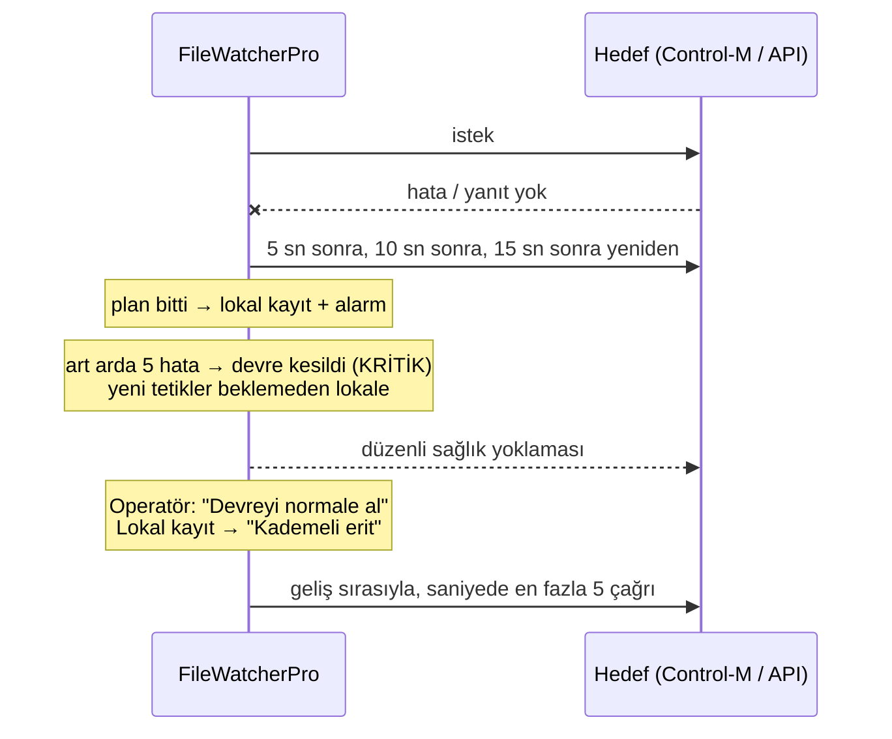

# 05 · Günlük işletim

- [Ekranlar](#ekranlar)
- [Bir dosyanın izini sürmek](#bir-dosyanın-izini-sürmek)
- [Durdurma türleri](#durdurma-türleri)
- [Hedef çöktüğünde: devre ve kademeli erit](#hedef-çöktüğünde-devre-ve-kademeli-erit)
- [Lokalde bekleyenler: seçerek gönder / sil](#lokalde-bekleyenler-seçerek-gönder--sil)
- [Alarmlar](#alarmlar)
- [Bileşenler](#bileşenler)
- [Bakım](#bakım)
- [Yapay zekâ asistanı ve anomali takibi](#yapay-zekâ-asistanı-ve-anomali-takibi)
- [Periyodik kontroller](#periyodik-kontroller)

---

## Ekranlar

| Sayfa | Ne gösterir / ne yapılır |
|---|---|
| **Genel bakış** | Üst çubukta genel durum (Her şey yolunda / Dikkat / Kritik). Günün sayıları, SLA, hedeflerin durumu, açık alarmlar; her dizinin altında kuralları ve tek tıkla durdur / aç. |
| **Dosyalar** | Görülen her dosya: durum, kural, tetik sonucu; arama. Satıra tıklayınca zaman çizelgesi açılır. |
| **Lokal kayıt ve erit** | Hedefe gönderilemeyen ya da hedef kapalıyken gelen tetikler; hedef başına kademeli erit; seçerek gönder / sil. |
| **Gönderilemeyenler** | Gönderilemeyen ya da kurala uymayan her dosyanın kaydı ve sebebi; çözülenler ve çözüm şekli (erit, elle, silindi…); CSV indir. |
| **Dizinler ve kurallar** | Dizin ve kural ekleme, düzenleme, durdurma; erişim durumu; "Şimdi dene". |
| **Hedefler** | Hedef kartları: durum, devre, sağlık; ekle, düzenle, gönderimi durdur, devreyi normale al. |
| **Ayarlar** | Çalışma ayarları (açıklama, varsayılan, aralık). |
| **Eklentiler** | Bileşenlerin durumu, PID, son nabız, yeniden başlatma sayısı; başlat / durdur / yeniden başlat; bakım geçmişi. |
| **Sistem izleme** | Sunucu ve FileWatcherPro CPU / bellek / disk, dizin tarama süreleri; son 24 saat. |
| **Yapay zekâ asistanı** | Öneriler, anomaliler, eğitim, güven, ilişkiler, toplanan veri (asistan bileşeni kuruluysa görünür). |
| **Alarmlar** | Açık ve kapanmış alarmlar, türüne göre süzme; onaylama; bu alarm için gerçekten mail gitti mi. |
| **Bildirimler (mail)** | SMTP, bildirim kuralları, gönderilen mail geçmişi, test maili. |
| **Denetim kaydı** | Kim, ne zaman, neyi değiştirdi (eski → yeni değer). |

Arayüz kendiliğinden güncellenir; sayfayı yenilemek gerekmez. Açık / koyu tema sağ üstten değiştirilir.

---

## Bir dosyanın izini sürmek

"Dosya geldi mi, iş başladı mı?" sorusunun cevabı **Dosyalar** sayfasındadır. Satıra tıklayınca zaman çizelgesi:

```
09:15:31  görüldü (yükleniyor)
09:15:42  tamamlandı · boyut 1,4 MB · içerik özeti
09:15:42  kural: fatura → hedef: Control-M Prod
09:15:42  istek gönderildi → HTTP 200, 180 ms · tetik kimliği 2ad1…
```

Gönderilemediyse her deneme, hata mesajı ve lokal kayda düşme sebebi aynı çizelgede görünür. Dosya hiç listede
yoksa: uzantısı dizinin listesinde değildir ya da dizine erişilemiyordur (bkz. [08 · Sorun giderme](08_SORUN_GIDERME.md)).

---

## Durdurma türleri

| Ne durur | Nereden | Etkisi |
|---|---|---|
| **Bir hedefe gönderim** | Hedefler → kart → *Gönderimi durdur* | O hedefe çağrı gitmez; kurallar ve tarama sürer. |
| **Tüm hedeflere gönderim** | Üst çubuk → *Gönderimi durdur (tüm hedefler)* | Hiçbir hedefe çağrı gitmez. |
| **Tek kural** | Kural satırı → *Durdur* | Yalnız o kuralın dosyaları. |
| **Bir dizinin kuralları** | Dizin kartı → *Kuralları durdur* | O dizindeki bütün kurallar. |
| **Tüm kurallar** | Dizinler ve kurallar → *Tüm kuralları durdur* | Bütün dizinlerin kuralları. |
| **Motor (tarama)** | Üst çubuk → *Motor çalışıyor* anahtarı | Yeni dosyalar fark edilmez. Kuyruktaki teslim sürer. Motor açılınca arada gelen dosyalar yakalanır. |

Hedef ve kural durdururken iki seçenek vardır:

- **Kayıtlı durdur (önerilen):** Gelen dosyalar algılanır ve tetikleri **lokal kayda** yazılır; kaybolmaz. Açınca
  kademeli erit ile geliş sırasıyla gider.
- **Kayıtsız durdur:** Onay ister. Gelen dosyalar gönderilmez, yalnız kaydı tutulur ("kayıtsız kapalıyken geldi").
  Bakım çalışması gibi, o arada gelenlerin hiç işlenmemesi gereken durumlar içindir.

Bir hedef ya da kural `kapali_hatirlatma_dk` (30 dk) süreden uzun kapalı kalırsa hatırlatma alarmı açılır.

---

## Hedef çöktüğünde: devre ve kademeli erit



1. Hedefe ulaşılamıyorsa her tetik deneme planıyla (5, 10, 15 sn) yeniden denenir; olmazsa **lokal kayda** yazılır
   (`veri\lokal_kayit\`) ve alarm açılır.
2. Art arda `otomatik_devre_esigi` (5) hata olursa **devre kesilir**: yeni tetikler hiç denenmeden lokale yazılır,
   hedef düzenli olarak yoklanır, KRİTİK alarm açılır.
3. Hedef düzelince (Hedefler kartında sağlık yanıtı görünür) operatör **Devreyi normale al** der. Yeni gelen dosyalar
   yeniden canlı gönderilir.
4. **Lokal kayıt ve erit → Kademeli erit başlat:** lokalde bekleyenler geliş sırasıyla, `erit_hizi` (saniyede 5)
   çağrıyla gönderilir. Yeni gelen dosyalar önceliklidir. Erit duraklatılabilir; bir kayıt yine hata verirse erit
   durur ve alarm açılır.

Kalıcı hatada (yanlış iş adı, yetki) devre beklenmez: tetik doğrudan lokale yazılır, KRİTİK alarm açılır. Kuralı ya da
hedefi düzeltip eriti başlatın; erit kuralın **güncel** isteğini kullanır.

---

## Lokalde bekleyenler: seçerek gönder / sil

Lokalde biriken tetiklerin hepsini değil bir kısmını göndermek ya da hiç gönderilmemesi gerekenleri çıkarmak için
**Lokal kayıt ve erit** sayfasında kayıtlar tek tek, "tümü" ya da filtreyle seçilir. İki işlem de **süper yönetici
şifresi** ister (pencerede kilit açılır, 10 dk o oturuma).

**Seçilenleri gönder** *(operatör)*: Seçilenler hemen sıraya girer; seçilmeyenler beklemeye devam eder. Elle
gönderilenler SLA istatistiğine girmez. Hedef hâlâ kapalıysa ya da hata verirse kayıt lokale geri döner; kaybolmaz.

**Seçilenleri sil** *(yönetici)*: Gerekçe (en az 5 karakter) ve "gönderilmeyeceğini anladım" onayı gerekir. Tek
işlem içinde:

1. Önce **tutanak** yazılır: `veri\lokal_silinen\tutanak_<zaman>_<kullanıcı>.json` (kim, ne zaman, neden, her
   tetiğin tam kaydı). Diske zorlanarak yazılır.
2. Lokal kayıt dosyası `veri\lokal_silinen\<gün>\` altına **arşivlenir** (silinmez).
3. Tetik **"Elle silindi"** olur; Gönderilemeyenler'de çözüm "ELLE_SILINDI (kullanıcı): gerekçe" olarak kapanır;
   denetim kaydına tek satır özet yazılır.

Silinen bir tetik erit ile de, yeniden başlatmayla da gönderilmez. İşlem geri alınamaz; tutanak ve arşiv inceleme
içindir.

---

## Alarmlar

Alarm bir **durum**dur: sorun sürdükçe açık kalır, düzelince kendiliğinden kapanır (ör. dizine yeniden erişilince).
**Onayla** alarmı kapatır; sorun sürüyorsa yeniden açılır. Kendiliğinden kapanmayan türler (ör. "çekirdek beklenmedik
kapandı") onaylanana kadar görünür.

Seviyeler: **KRİTİK** (iş duruyor ya da veri riski: devre kesildi, dizine erişilemiyor, disk doldu), **UYARI** (dikkat
gerekiyor), **BİLGİ** (kayıt amaçlı). Hangi olayın kime maillendiği **Bildirimler** sayfasında belirlenir. Olay listesi:
[Yönetici veri sayfası](YONETICI_VERI_SAYFASI.md#8-olay-ve-alarm-kataloğu).

---

## Bileşenler

**Eklentiler** sayfasında her bileşen (tarama, teslim, kontrol, izleme, bildirim, asistan) ayrı süreçtir.

- Düşen bileşen gözetmen tarafından bekleme planıyla (1, 2, 5, 10, 30 sn) yeniden başlatılır. Art arda 5 kez düşerse
  **elle müdahale** durumuna geçer ve KRİTİK alarm açılır; sorunu giderip *Başlat* deyin.
- Ana döngüsü 60 sn ilerlemeyen bileşen "takılmış" sayılır ve yeniden başlatılır.
- Elle durdurulan bileşen, siz başlatana kadar (servis yeniden başlasa bile) durur.
- *Teslim*'i durdurmak gönderimi durdurur ama bekleyen tetiklere `kapanis_teslim_bekleme_sn` (15 sn) tanınır;
  bitmeyenler veritabanında kalır ve açılışta gider.

---

## Bakım

Haftalık bakım (varsayılan **Cumartesi 03:00**) kendiliğinden çalışır; makine o saatte kapalıysa açılışta yapılır.
**Eklentiler → Şimdi bakım yap** ile elle de başlatılır. Adımlar:

1. Ön kontrol (veritabanı bütünlüğü)
2. Son sağlam kopya: `veri\yedek\` altına veritabanı yedeği (bir önceki de `.onceki` olarak tutulur)
3. Geçmiş budaması (`gecmis_limit`, `hata_limit`, `denetim_limit`)
4. İndeksleri yeniden kurma ve istatistik, WAL sıfırlama, boş alanı geri verme
5. Boyut kontrolü (beklenmedik büyümede alarm)

Bir adım hata verirse o adım tamamen geri alınır, kalan adımlar atlanır ve alarm açılır; veritabanı çalışan son
hâlinde kalır. İzleme ve teslim bakım boyunca durmaz. Yedekten geri yükleme
otomatik yapılmaz (bkz. [Yönetici veri sayfası · yedek ve geri yükleme](YONETICI_VERI_SAYFASI.md#10-yedek-ve-geri-yükleme)).

---

## Yapay zekâ asistanı ve anomali takibi

Asistan isteğe bağlı bir bileşendir; yerelde çalışır, dışarı veri göndermez, **tetik yoluna karışmaz** (gölge modu:
yalnız öneri verir). Dosya içeriği okunmaz; dosya adları asistanın veritabanına yazılmaz.

### Öneriler

- **Beklenen dosya gelmedi:** Geçmiş günlerde belli bir saat aralığında gelen dosya bugün gelmediyse.
- **Anomali** (aşağıda).
- **Model önerileri:** Olay dizilerinden öğrenen küçük bir model (PyTorch varsa); güveni geçmiş isabetine göre
  ayarlanır.

Her öneride kanıt yazar. **Faydalı / Faydasız** geri bildirimi verilebilir; geri bildirim isabeti asistanın güven
karnesinde gösterilir.

### Anomali takibi (Anomaliler sekmesi)

Her kural için geçmişten "normal" çıkarılır; yeni değer bunun dışına düşerse kanıtlı öneri yazılır. Model değil
istatistiktir; PyTorch gerektirmez.

| Ölçüt | Anomali sayılan |
|---|---|
| **Dosya boyutu** | Geçmişin normalinden belirgin büyük ya da küçük (log ölçeğinde medyan / MAD, en az 1,5 kat fark). Ör. hep 1–2 MB gelen dosya 3 KB geldi. |
| **Teslim süresi** | Son 10 teslimin medyanı geçmişin en az 3 katı ve en az 2 sn. |
| **Günlük adet** | Dün gelen adet, önceki 14 günün medyanının yarısı ya da altı / iki katı ya da üstü. |

Bir kuralın normali en az 20 dosyadan çıkar; günlük adet için en az 7 günlük geçmiş gerekir. Aynı kuralda aynı yönde
24 saat içinde gelen anomaliler tek öneride toplanır ("Toplanan: N dosya").

Varsayılan olarak yalnız öneri yazılır. **"Anomaliyi alarm olarak da aç"** seçilirse UYARI alarmı açılır (olay:
"Dosyalarda anomali"); bu olay kurala bağlı mail alıcılarında seçiliyse mail gider. Normal bir dosya gelince alarm
kendiliğinden kapanır.

---

## Periyodik kontroller

| Sıklık | Kontrol |
|---|---|
| Günlük | Genel bakış "Her şey yolunda" mı; açık KRİTİK alarm var mı; Lokal kayıtta bekleyen var mı; Gönderilemeyenler'de çözülmemiş kayıt var mı |
| Haftalık | Bakım sonucu (Eklentiler → bakım geçmişi); Sistem izleme'de disk ve bellek eğilimi; asistan önerileri |
| Aylık | Kullanıcı listesi ve roller (`araclar\kullanici.py liste`); denetim kaydında beklenmeyen değişiklik; `veri\yedek\` kopyalarının yedekleme sistemine alındığı |
| Değişiklikten sonra | Yeni / değişen kuralda canlı ve kuru deneme; bir deneme dosyasıyla uçtan uca doğrulama |
