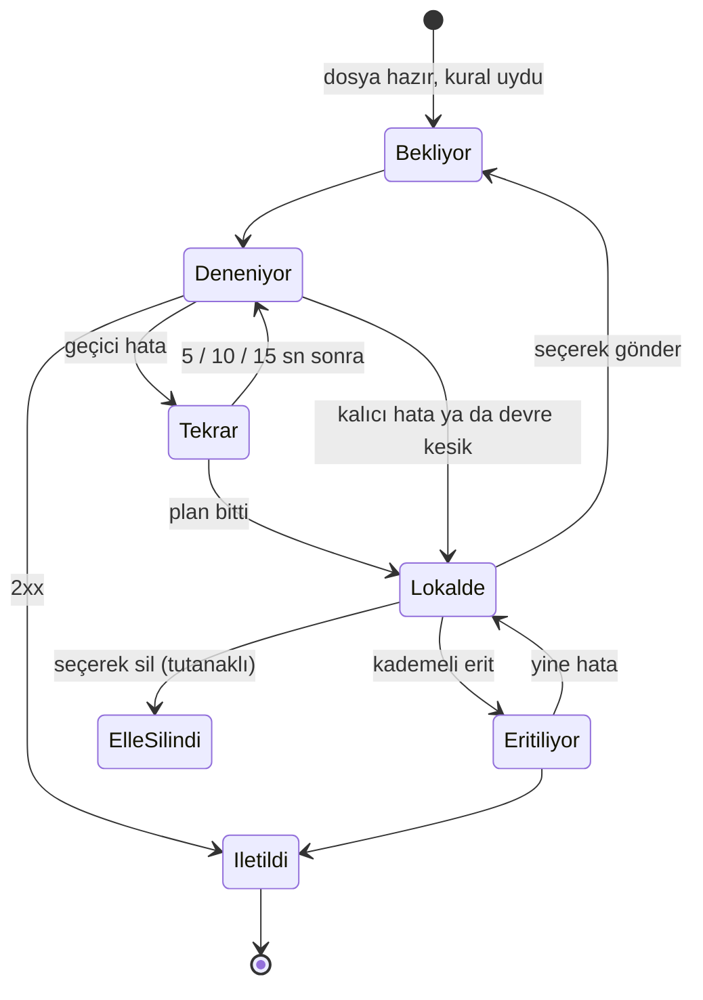

# 06 · Arıza davranışı ve güvenceler

## Güvenceler

| Güvence | Nasıl sağlanır |
|---|---|
| **Kayıp yok** | Tetik, hedefe gitmeden önce veritabanına yazılır. Gönderilemeyen tetik silinmez: yeniden denenir, olmazsa diskte lokal kayda (JSON) yazılır ve alarm açılır. Veritabanı kaybolsa bile açılışta lokal kayıttan geri yüklenir. Kapalıyken gelen dosyalar açılışta yakalanır. |
| **Yanlış dosyaya tepki yok** | Yazılmakta olan (boyut / tarih değişen, başka süreçte açık) ya da geçici adla yüklenen dosya tetiklenmez; yalnız kurala tam uyan ad tetiklenir. |
| **Aynı dosya iki kez tetiklenmez** | Her dosyanın kimliği (dizin + ad + içerik özeti) tutulur; yeniden başlatma, ağ kopması, geç gelen tarih değişikliği yeni tetik üretmez. |
| **Çift görünür** | Her tetik benzersiz bir kimlik taşır ve yeniden denemede aynı kalır. Gönderilip yanıtı alınamayan istek "olası çift" diye işaretlenir. Seçim bilinçlidir: kayıp riski yerine görünür ve ayırt edilebilir bir çift riski. |
| **Sıra** | Kademeli erit geliş sırasıyla gönderir; hedef başına aynı anda tek erit çağrısı yapılır, varış sırası korunur. |
| **Kendi kendini toparlar** | Her bileşen ayrı süreçtir; düşen ya da takılan bileşen yeniden başlatılır. Servis bekçisi çekirdeği, Windows kurtarma ayarı servisi yeniden başlatır. |

## Arıza senaryoları

Aşağıdaki her satır otomatik testlerle ve uçtan uca saha provasıyla (sahte Control-M / API / mail sunucularıyla,
süreçler gerçekten öldürülerek) denenmiştir.

| Durum | Sistem ne yapar |
|---|---|
| Hedef hata veriyor ya da yanıt vermiyor | 5, 10, 15 sn sonra yeniden dener. Olmazsa tetik lokal kayda yazılır, alarm açılır. |
| Hedef çöktü (art arda 5 hata) | Devre kesilir: yeni tetikler beklemeden lokale yazılır, hedef düzenli yoklanır, KRİTİK alarm. Düzelince operatör devreyi normale alır ve kademeli eriti başlatır: lokaldekiler geliş sırasıyla, saniyede en fazla 5 çağrıyla gider; yeni gelen dosyalar önceliklidir. |
| İstek gitti, cevap gelmeden süre doldu | Hedef işi başlatmış olabilir. Tetik aynı kimlikle yeniden gönderilir ve "olası çift" işaretlenir. |
| Hedef isteği reddetti (yanlış iş adı, yetki) | Boşuna tekrar denenmez; lokale yazılır, KRİTİK alarm. Kural ya da hedef düzeltilince erit ile gönderilir (güncel istekle). |
| Hedef aşırı yükte (429) | Geçici hata olarak yeniden denenir; Control-M hedefinde bildirilen `Retry-After` süresine uyulur. |
| Hedef yavaşladı | Son 10 dakikada iletilenlerin %20'si SLA'yı aşarsa uyarı; %5'in altına inince kendiliğinden kapanır. |
| Betik hata verdi | Çıkış kodu 10 → kalıcı (lokal + KRİTİK alarm). Diğer kodlar → yeniden deneme. Süre dolarsa betik ve başlattığı tüm süreçler sonlandırılır; tetik yeniden denenir, "olası çift" işaretlenir. |
| Ani yük | 300 dosya aynı anda geldiğinde hepsi 2,4 sn'de iletildi; çift yok (ölçüm). |
| İzlenen ağ paylaşımına erişilemiyor | 5, 10, 15 sn denenir, sonra "erişilemez" KRİTİK alarm; 30 sn'de bir yeniden denenir. Erişim gelince arada gelen dosyalar yakalanır. Listeleme 20 sn'yi aşarsa "yanıtsız" sayılır (ağ takılması). |
| Dosya çok uzun süre yazılıyor | 30 dk'yı aşarsa "yükleme askıda" uyarısı; dosya tamamlanınca normal akış. |
| Bir bileşen çöktü ya da takıldı | Gözetmen fark edip yeniden başlatır (1, 2, 5, 10, 30 sn); art arda 5 kez düşerse "elle müdahale" KRİTİK alarm. Diğer bileşenler etkilenmez. |
| Çekirdek ya da servis çöktü, sunucu yeniden başladı | Servis bekçisi çekirdeği yeniden başlatır; servis düşerse Windows kurtarma ayarı. Kapalıyken gelen dosyalar açılışta yakalanır; eski dosyalar yeniden tetiklenmez. Bileşenler çekirdekle birlikte kapanır; sahipsiz süreç kalmaz. |
| Gönderim ya da erit sırasında süreç öldü | Yarım kalan tetik "olası çift" işaretlenerek yeniden gönderilir; erit kaldığı yerden sürer. Teslimden hemen sonra (lokal dosya silinmeden) ölündüyse açılışta artık kopya temizlenir; aynı dosya ikinci kez gönderilmez. |
| Lokal kayda yazılamıyor (disk dolu) | Tetik veritabanında güvende kalır, KRİTİK alarm; yazım düzenli olarak yeniden denenir. |
| Lokal kayıt dosyası bozuk | Karantinaya (`veri\karantina\`) alınır, KRİTİK alarm, gönderilemeyen kaydı açılır; elle incelenir. |
| Veritabanı kaybı / bozulması | Lokalde bekleyen tetikler açılışta lokal kayıttan geri yüklenir. Haftalık bakım son sağlam kopyayı `veri\yedek\` altında tutar (geri yükleme elle yapılır). |
| Servis düzgün kapatılıyor | Bekleyen tetiklere 15 sn verilir; bitmeyenler veritabanında kalır, açılışta gider. Çalışan betikler sonlandırılır ve açılışta yeniden çalışır. |
| Mail sunucusuna ulaşılamıyor | 30 sn, 2 dk, 5 dk, 15 dk, 30 dk sonra yeniden dener; olmazsa "mail gönderilemiyor" alarmı arayüzde görünür. İzleme ve teslim etkilenmez. |
| Disk, bellek, CPU eşikleri aşıldı | Sistem izleme alarm açar (disk boş alanı 5 GB altı KRİTİK); değer normale dönünce 1 dk sonra kapanır. |
| Bakım adımı hata verdi | O adım geri alınır, kalan adımlar atlanır, alarm açılır; izleme durmaz. |
| Bileşen elle durduruldu | Siz başlatana kadar durur; servis yeniden başlasa da kendiliğinden başlamaz. |

## Bir tetiğin Control-M kesintisindeki yolu

## Bilinen sınırlar

| Konu | Açıklama | Ne yapılabilir |
|---|---|---|
| Kesik yükleme | Bağlantısı kopup yarım kalan dosya, dosya sisteminden bakınca tamamlanmış dosyadan ayırt edilemez. | FTP sunucusunda "geçici adla yükle, bitince yeniden adlandır" seçeneğini açın; bu yöntem tam desteklenir. |
| Çok kısa ömürlü dosya | Tarama aralığından (2 sn) kısa sürede gelip silinen dosya görülemez (listeleme tabanlı izlemenin doğası). | Dosyayı alan iş, FileWatcherPro tetikledikten sonra dosyayı almalıdır. |
| Saat sıçraması | Sunucu saatinin ileri / geri atlaması süre ölçümlerini (SLA) etkileyebilir, tetiklemeyi etkilemez. | Saat eşitlemesini düzenli tutun. |
| PowerShell ve grup ilkesi | Grup ilkesi imzasız betikleri engelliyorsa PowerShell betik hedefi çalışmaz. | Betiği imzalayın ya da Python kullanın. |
| Tek sunucu | Aynı veri klasörü için tek kopya çalışır; etkin-etkin küme yoktur. | Sunucu düzeyinde yedeklilik (sanal makine kopyası, yedekten dönüş) kullanın. |
